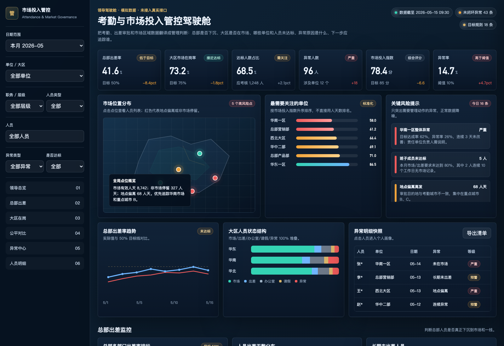
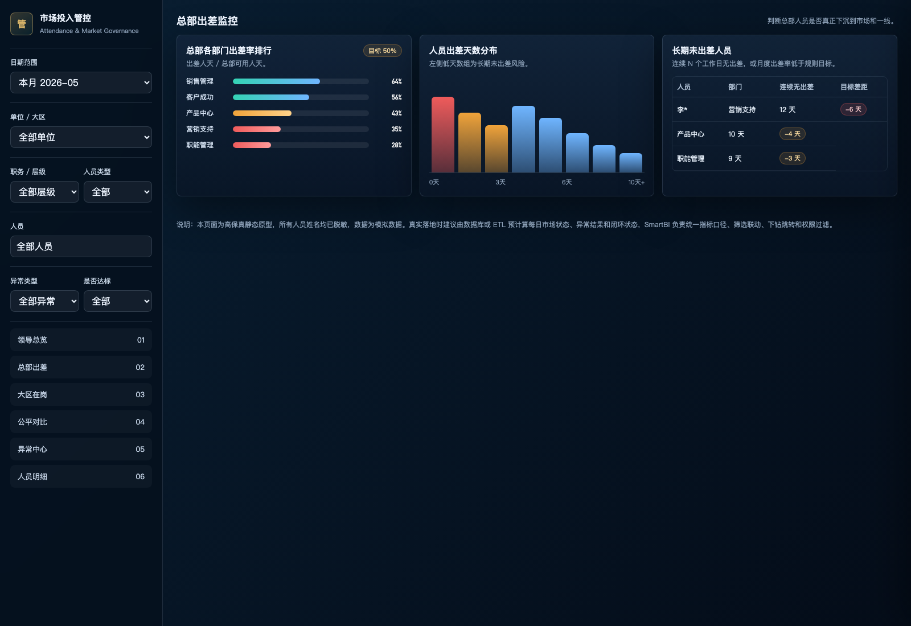
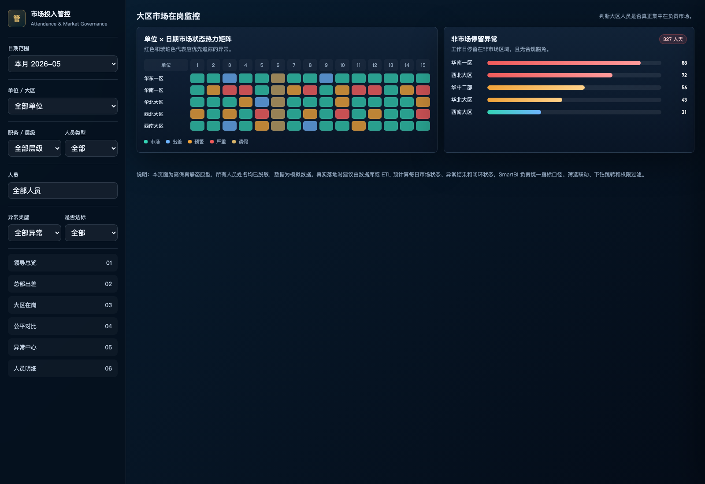
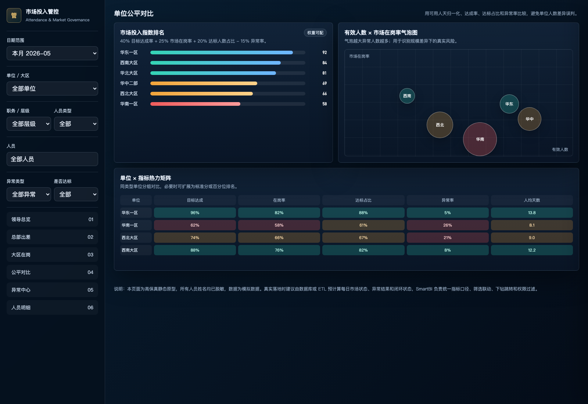
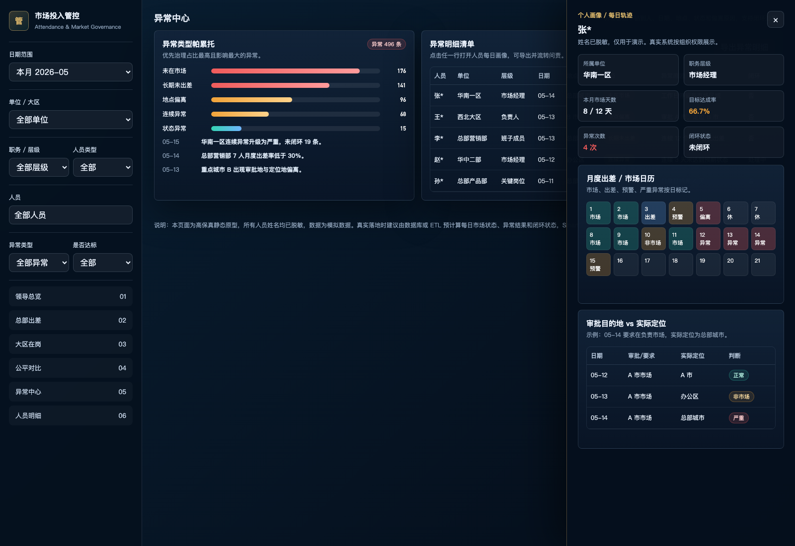

# 考勤与市场投入管控看板优化方案_领导版

## 一句话结论

新看板不是把考勤数据换一种图表展示，而是把考勤、出差和市场位置数据变成管理判断：看总览，判断全局是否达标；看异常，定位哪个单位、哪个人、哪一天不达标；看对比，用标准化指标避免单位人数差异造成误判。

> 说明：原 SmartBI 分享链接本次未访问到，以下预览基于需求重构和模拟数据制作，人员姓名均已脱敏。

## 1. 看总览，判断全局是否达标

领导打开看板第一屏，先看到总部出差率、大区市场在岗率、达标人数占比、异常人数、异常单位数和市场投入指数。低于目标的指标直接标红或标琥珀色，正常信息弱化。

领导能立即判断：

- 总部有没有下沉。
- 大区有没有在市场。
- 全公司达标人数占比是否足够。
- 当前最需要关注的单位和人员是谁。
- 哪些异常需要今天处理。

## 2. 看总部出差，判断总部是否真正下沉

总部出差专题展示总部出差率趋势、部门排行、人员出差天数分布和长期未出差清单。重点不是看谁打卡，而是看总部人员是否按要求到一线。

领导能判断：

- 哪些总部部门出差率低于目标。
- 哪些人员长期没有出差。
- 出差不足是个别人员问题，还是部门整体问题。

## 3. 看大区在岗，判断大区是否在市场

大区专题展示市场在岗率、状态结构、人员位置分布和单位日期热力矩阵。红色日期和单位代表需要追踪。

领导能判断：

- 大区人员是否集中在负责市场。
- 哪些大区存在非市场停留。
- 异常是偶发还是连续发生。

## 4. 看公平对比，避免单位人数差异造成误判

单位之间不直接比“人天数”。大单位人多，人天数天然高；小单位人少，即使投入强度高也可能排名靠后。新看板用标准化指标比较：可用人天归一化比例、人均市场天数、目标达成率、达标人数占比、异常率和市场投入指数。

领导能判断：

- 哪些单位是真正投入不足。
- 哪些单位只是规模小，但投入强度达标。
- 哪些单位异常率高，需要问责。

## 5. 看异常，追到单位、人员、日期和原因

异常中心把异常从“看到”变成“能追踪”。每条异常都能落到人、日期、地点、状态、是否出差、是否在市场和偏离原因。

领导能追到：

- 哪个单位不达标。
- 哪个人不达标。
- 哪一天不达标。
- 实际在哪里。
- 为什么判定异常。
- 是否闭环、责任人是谁。

## 6. 建议上线形态

- 领导版：大屏驾驶舱，突出结论、排名和严重异常。
- 工作员版：分析型页面，保留更多筛选、表格和导出能力。
- 单位负责人版：只看本单位和授权人员。
- 异常闭环：严重异常形成清单，可导出，后续可对接企业微信、钉钉或邮件推送。

## 7. 管理价值

1. 从“展示考勤”变成“管控行为”。
2. 用标准化指标比较单位，避免人数差异误导判断。
3. 异常直接落到人、日期、地点，支持追踪问责。
4. 领导 30 秒看全局，3 分钟定位责任单位和责任人。

